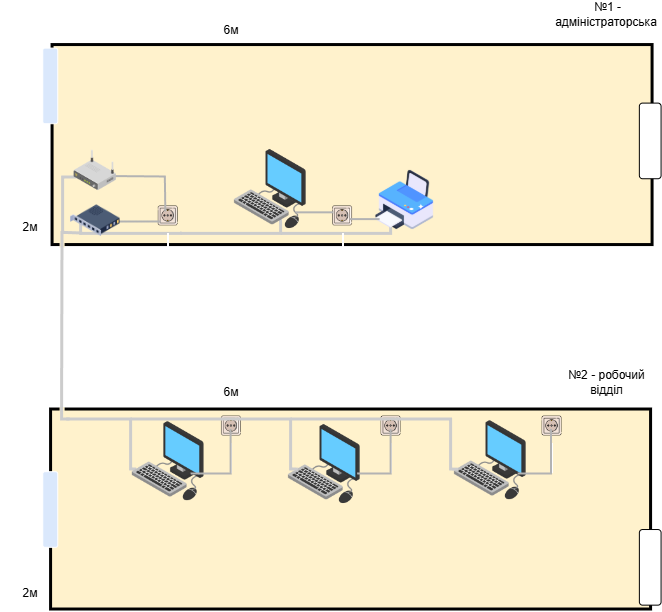

# МІНІСТЕРСТВО ОСВІТИ І НАУКИ УКРАЇНИ  
## Донецький національний університет імені Василя Стуса  
### Факультет інформаційних і прикладних технологій  
### Кафедра інформаційних технологій  

---

# ЗВІТ  
## з лабораторної роботи №2  
### з дисципліни «Комп’ютерні мережі»  
### на тему:  
# «Пристрій, підключений до мережі Інтернет»

---

**Виконав:** студент групи КН-25-А  
Карпенко С. Д.  

**Місто:** Вінниця  
**Рік:** 2026  

---

## 1. Вибір та призначення приміщення

Відповідно до варіанта завдання обрано план приміщення №8.  

Призначення приміщення — малий офіс (IT-відділ), що складається з двох кімнат.

**Кімната №1 (Серверна / Адміністраторська):**
- розташування комутаційного обладнання;
- робоче місце адміністратора;
- мережевий принтер.

**Кімната №2 (Робочий зал):**
- три робочі місця співробітників.

---

## 2. Підбір обладнання та обґрунтування вибору

Для побудови локальної мережі обрано топологію **«Зірка»**, що забезпечує простоту адміністрування, зручність масштабування та підвищену надійність.

### 2.1 Маршрутизатор

**TP-Link Archer C6**

Обраний для:
- забезпечення доступу до мережі Інтернет;
- створення бездротової мережі Wi-Fi;
- маршрутизації локального трафіку.

### 2.2 Комутатор

**TP-Link LS1008D (8 портів)**

Оскільки маршрутизатор має 4 LAN-порти, а необхідно підключити 4 персональні комп’ютери та 1 принтер, додатково використано 8-портовий комутатор.

### 2.3 Кабельна система

Використовується кабель типу **UTP Cat 5e**, який забезпечує швидкість передачі даних до 1 Гбіт/с та відповідає сучасним стандартам офісних мереж.

### 2.4 Додаткові елементи

- 5 накладних розеток RJ-45;
- конектори RJ-45;
- мережеві фільтри живлення;
- 4 офісні ПК;
- БФП HP LaserJet M141w.

---

## 3. Схема розташування обладнання

---

## 4. Кошторис проекту

| Найменування обладнання | Ціна (грн) | Кількість | Вартість (грн) |
|--------------------------|------------|------------|----------------|
| Маршрутизатор TP-Link Archer C6 | 1600 | 1 | 1600 |
| Комутатор TP-Link LS1008D | 450 | 1 | 450 |
| Кабель UTP Cat 5e | 16 | 100 | 1600 |
| Розетка RJ-45 | 130 | 5 | 650 |
| Конектор RJ-45 | 3 | 50 | 150 |
| Мережевий фільтр | 400 | 5 | 2000 |
| ПК офісний | 15000 | 4 | 60000 |
| БФП HP LaserJet M141w | 9000 | 1 | 9000 |

**Загальна вартість проекту: 75 450 грн**

---

## 5. Висновок

У ході виконання лабораторної роботи було розроблено проект локальної мережі малого офісу на дві кімнати.  

Було здійснено:
- вибір топології мережі;
- підбір мережевого обладнання;
- розрахунок необхідної кількості матеріалів;
- формування кошторису проекту.

Спроєктована мережа відповідає вимогам сучасної офісної інфраструктури та забезпечує можливість подальшого розширення.
